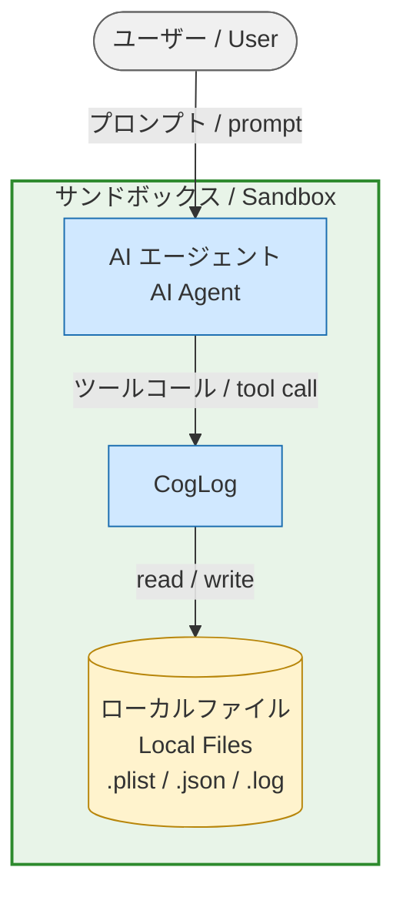
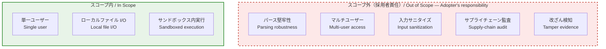

# CogLog — セキュリティに関する注意事項 / Security Considerations

## 脅威モデル / Threat Model

CogLog は **単一ユーザー・ローカル専用** のメタ認知ログツールであり、AI アシスタント付きサンドボックス（Claude Code、Cursor、Copilot Workspace 等）内での動作を想定している。

CogLog is a **single-user, local-only** cognitive logging tool designed to run
inside an AI-assisted sandbox (e.g. Claude Code, Cursor, Copilot Workspace).

**ネットワークサービスではない。** 以下の機能を持たない:

**It is NOT a networked service.** It has:

- 認証・認可機構 / No authentication or authorization mechanism
- 暗号化（保存時・通信時とも） / No encryption (at rest or in transit)
- 外部ネットワークアクセス / No outbound network access
- デーモン・リスニングソケット / No daemon or listening socket

すべてのデータはユーザーのローカルファイルシステム上にプレーンテキスト（`.plist`、`.json`、`.log`）として保存される。セキュリティ境界はサンドボックスそのものである。

All data is stored as plain-text files (`.plist`, `.json`, `.log`) under the
user's local filesystem. The security boundary is the sandbox itself.

## 信頼の前提 / Trust Assumptions

| 前提 / Assumption | 根拠 / Rationale |
|---|---|
| サンドボックスが正しく隔離されている / The sandbox is correctly isolated | CogLog はホスト環境（Docker、VM 等）に隔離を委任する / CogLog delegates containment to the host environment (Docker, VM, etc.) |
| サンドボックスを操作するユーザーは一人である / Only one user operates the sandbox | アクセス制御・ファイルロック・マルチテナンシーの仕組みはない / There is no access control, file locking, or multi-tenancy support |
| 入力は整形済みまたは無害である / Input is well-formed or benign | パーサーは最小限であり、敵対的入力は対象外 / Parsers are minimal; adversarial input is out of scope |
| AI エージェントは協調的である / The AI agent is cooperative | CogLog は AI からのツールコールパラメータを信頼する。プロンプトインジェクションに対する検証層はない / CogLog trusts tool-call parameters from the AI; there is no validation layer against prompt-injection payloads |

## エンタープライズ採用に関する注意 / Enterprise Adoption Notice

CogLog は個人ユーザーが自身の AI 環境内で使用することを前提に設計されている。マルチユーザー環境や本番環境への導入を検討する場合、以下の領域は**本プロジェクトのスコープ外**であり、採用者の責任となる。

CogLog is designed for individual users operating within their own AI
environment. If you are evaluating it for multi-user or production deployment,
the following areas are **out of scope for this project** and fall under the
adopter's responsibility.

- **パース処理の堅牢性 / Parsing robustness** —
  11 言語間の移植性のため、手書きパーサー（`jq` ベースのシェル、正規表現による抽出）を使用している。敵対的・不正な入力に対する耐性は備えていない。

  Hand-rolled parsers (`jq`-based shell, regex-based extraction) are used
  for portability across 11 languages. They are not hardened against
  adversarial or malformed input.

- **マルチユーザー・マルチテナント / Multi-user / multi-tenant access** —
  ユーザー・セッション・権限・ファイルロックの概念はない。同時アクセス時の動作は未定義である。

  There is no concept of users, sessions, permissions, or file locking.
  Concurrent access is undefined.

- **入力サニタイズ / Input sanitization** —
  タグ名・ログメッセージ・オプション値は最小限の検証のみで通過する。ログインジェクションやパストラバーサルに対する防御はない。

  Tag names, log messages, and option values are passed through with
  minimal validation. Log injection and path traversal are not defended
  against.

- **サプライチェーン監査 / Supply-chain audit** —
  ポリグロット実装群は共通の依存管理戦略を持たない。各言語のビルドは独立している。

  The polyglot implementations share no common dependency-management
  strategy. Each language's build is independent.

- **改ざん検知 / Tamper evidence** —
  CogLog は追記専用ログや暗号学的コミットメントを持たない。

  CogLog does not maintain append-only or cryptographically committed logs.

これらはバグではなく、意図的なスコープの境界である。CogLog をより広いシステムに組み込む採用者は、自身のセキュリティ要件に従ってこれらの領域を評価・対処しなければならない。

These are not bugs — they are deliberate scope boundaries. Adopters
integrating CogLog into a broader system must evaluate and address these
areas according to their own security requirements.
