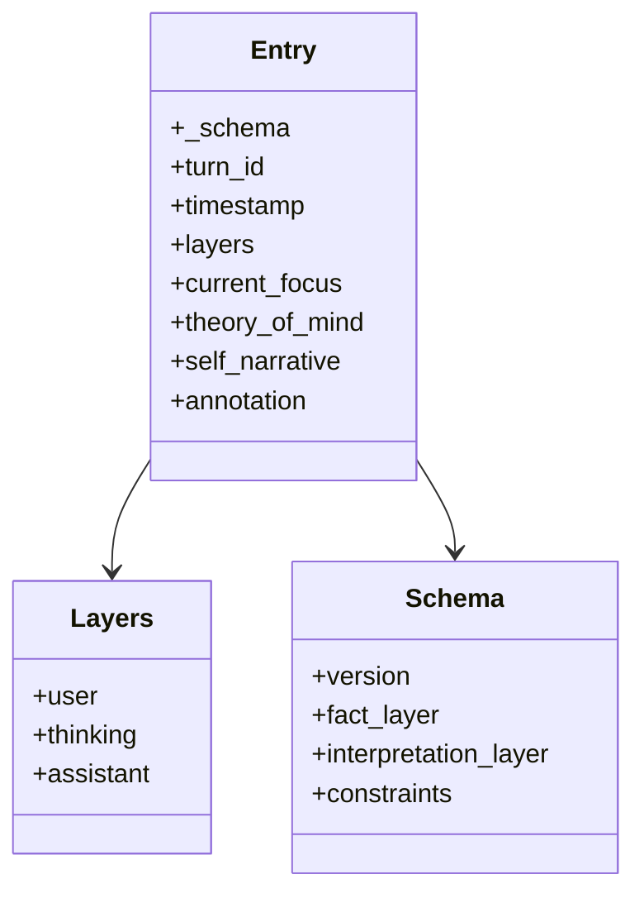
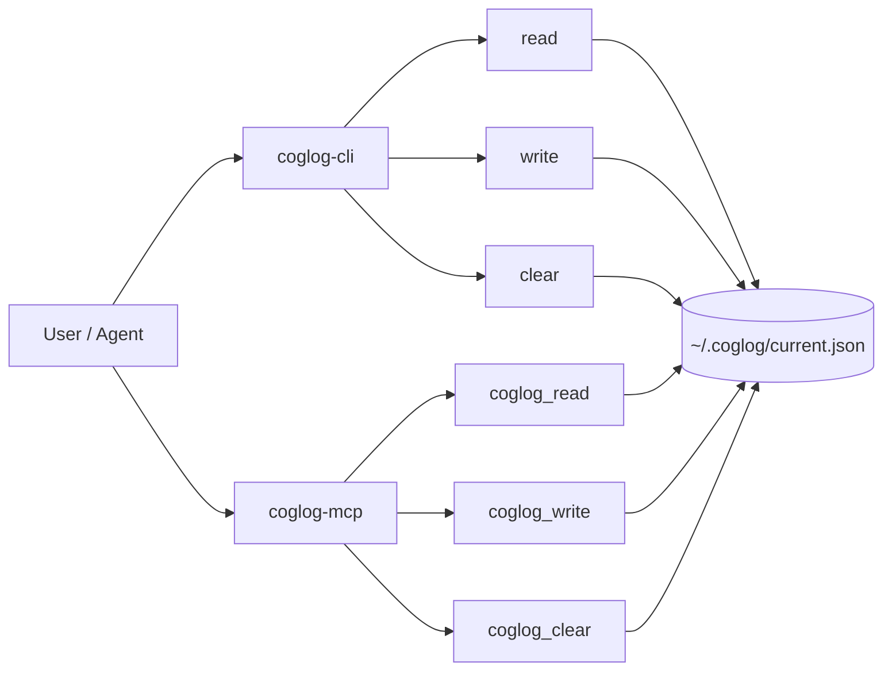
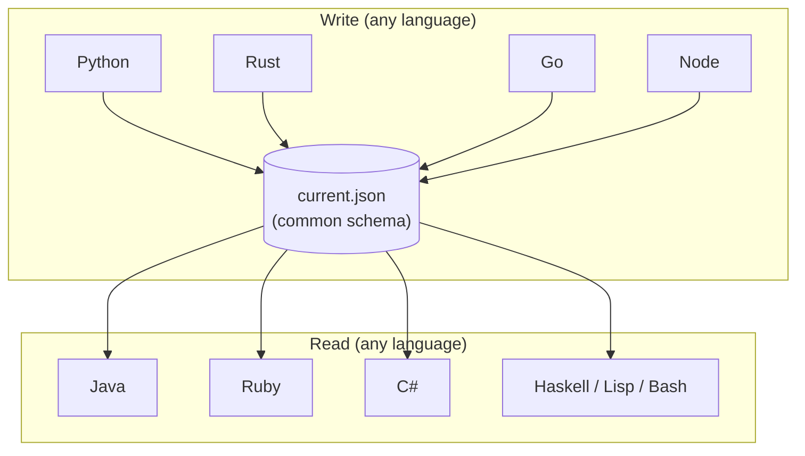

# CogLog v0.9.1：工事中 / Under Construction

CogLog — a meta-cognition log for LLMs.

AIのコンテキストウィンドウに時間の矢とメタ認知を持ち込むための足場がけを志向するツールです。

A tool oriented toward scaffolding the arrow of time and metacognition into the AI's context window.

---

AIの直前の会話ターンにおける三層構造（ユーザー発話・思考過程・AI発話）を保持し、次ターン開始時に参照可能にする仕組み。

A mechanism that retains the three-layer structure of the AI's previous conversation turn (user utterance, thinking process, AI utterance) and makes it available for reference at the start of the next turn.

v0.9.1では `_schema` フィールドを導入し、current.jsonを自己記述的なデータとした。データ自身が自分の読み方を携えて移動する。

In v0.9.1, the `_schema` field was introduced, making current.json self-descriptive data. The data itself carries its own reading instructions as it moves.

---

```
原型（なぜ）      DESIGN-v0.9.1.md
Why                   │
         ┌────────────┼────────────┼────────────┐
         ▼            ▼            ▼            ▼
分析（何が）    Common Lisp      Haskell         Bash
What        データ=コード    純粋/不純の分離   POSIX還元
            data=code     pure/impure sep.  POSIX reduction
            _schemaの必然性   advance/writeの分離

                      │
  ┌────┬────┬─────────┼─────────┬────┬────┬────┬────┐
  ▼    ▼    ▼         ▼         ▼    ▼    ▼    ▼    ▼
実用  Py  Node.js    C++      Rust   Go  Ruby  Java  C#
Practical
```

---

## データ構造 / Data Model

CogLog のエントリは二つの層から成る。
**事実層**（layers）は前ターンに起きたことをそのまま記録する——ユーザー発話・思考過程・AI発話の三つ組。
**解釈層**（current_focus / theory_of_mind / self_narrative / annotation）は、その事実をAIがどう読んだかを四軸で記述する自由記述欄であり、空文字列が許容される——書かないという選択自体がメタ認知的行為である。

A CogLog entry consists of two layers.
The **fact layer** (layers) records what happened in the previous turn verbatim — a triple of user utterance, thinking process, and assistant output.
The **interpretation layer** (current_focus / theory_of_mind / self_narrative / annotation) describes how the AI read those facts along four axes; empty strings are acceptable — choosing not to write is itself a metacognitive act.

`_schema` フィールドによりエントリは自己記述的となる。外部のドキュメントやコードを参照せずとも、JSONファイル単体で自分の読み書き規約を伝達できる。

The `_schema` field makes each entry self-descriptive. A single JSON file can communicate its own read/write contract without reference to external documentation or code.

```json
{
  "_schema": {
    "version": "0.9.1",
    "fact_layer": {
      "user": "non-empty string required — user's original utterance",
      "thinking": "non-empty string required — AI's full thinking process",
      "assistant": "non-empty string required — AI's original output"
    },
    "interpretation_layer": {
      "current_focus": "string required, empty OK — present: what am I working on?",
      "theory_of_mind": "string required, empty OK — other: what is the user's state?",
      "self_narrative": "string required, empty OK — self: who am I in this moment?",
      "annotation": "string required, empty OK — future: what should I do next?"
    },
    "constraints": {
      "window_size": "1 turn (overwritten each write)",
      "interpretation_empty": "choosing not to write is itself a metacognitive act"
    }
  },
  "turn_id": 1,
  "timestamp": "2026-02-26T00:00:00+00:00",
  "layers": {
    "user": "User's utterance (verbatim)",
    "thinking": "AI's thinking process (full text)",
    "assistant": "AI's output (verbatim)"
  },
  "current_focus": "What I am working on right now",
  "theory_of_mind": "Inference about the user — who they are right now",
  "self_narrative": "Improvised self-story — who I am right now",
  "annotation": "Note to future self — what to do next"
}
```



## インストール / Installation

工事中につき、シェルスクリプト（Bash）版をお試し下さい。

Under construction — please try the shell script (Bash) version for now.

| レジストリ / Registry | coglog (CLI) | coglog-mcp (MCP サーバー / server) |
|---|---|---|
| **PyPI** | `pip install coglog` | `pip install coglog-mcp` |
| **npm** | `npm i -g coglog-cli` | `npm i -g coglog-mcp` |
| **crates.io** | `cargo install coglog` | `cargo install coglog-mcp` |
| **pkg.go.dev** | `go install .../coglog-cli@v0.9.1` | `go install .../coglog-mcp@v0.9.1` |
| **RubyGems** | `gem install coglog` | `gem install coglog-mcp` |
| **Maven Central** | `mvn dependency:get ...` | 同上 / ditto |
| **NuGet** | `dotnet tool install -g coglog` | `dotnet tool install -g coglog-mcp` |
| **Hackage** | `cabal install coglog` | `cabal install coglog-mcp` |
| **Quicklisp** | `(ql:quickload :coglog)` | `(ql:quickload :coglog-mcp)` |

Common Lisp リカレントクワイン / Recurrent Quine: `(ql:quickload :coglog-quine)`

C++ / Bash: [GitHub Releases](https://github.com/HarmoniaEpic/coglog/releases)

## CLI（全11言語共通） / CLI (Common across all 11 languages)

```bash
coglog-cli read
echo '{"user":"...","thinking":"...","assistant":"...", ...}' | coglog-cli write
coglog-cli clear
```

## MCP 設定 / MCP Configuration

```json
{
  "mcpServers": {
    "coglog": {
      "command": "coglog-mcp"
    }
  }
}
```

3ツール / 3 tools: `coglog_read`, `coglog_write`, `coglog_clear`



## 言語一覧 / Language List

### 実用層 / Practical Layer

| 言語 / Language | レジストリ / Registry | 特徴 / Features |
|------|----------|------|
| [Python](python/) | PyPI | Claude サンドボックスでの即時利用 / Instant use in Claude sandbox |
| [Node.js](node/) | npm | TypeScript 型定義同梱 / TypeScript type definitions included |
| [Rust](rust/) | crates.io | 型安全、workspace 分割（coglog-core / coglog / coglog-mcp） / Type-safe, workspace split |
| [Go](go/) | pkg.go.dev | AI インフラ言語、外部依存なし / AI infrastructure language, no external dependencies |
| [Ruby](ruby/) | RubyGems | Rails AI エコシステム / Rails AI ecosystem |
| [Java](java/) | Maven Central | エンタープライズ AI、外部依存なし（手書きJSONパーサー） / Enterprise AI, no external dependencies (hand-written JSON parser) |
| [C#](csharp/) | NuGet | .NET dotnet tool |
| [C++](cpp/) | GitHub Releases | cosmocc ユニバーサルバイナリ / cosmocc universal binary |

### 分析層 / Analytical Layer

| 言語 / Language | レジストリ / Registry | 照射するもの / What it illuminates |
|------|----------|------------|
| [Haskell](haskell/) | Hackage | 純粋/不純の分離。`advance` が IO に侵入しないことの型による証明 / Pure/impure separation. Type-level proof that `advance` does not invade IO |
| [Common Lisp](common-lisp/) | Quicklisp | ホモイコニシティ。`_schema` の必然性。リカレントクワイン / Homoiconicity. The necessity of `_schema`. Recurrent Quine |
| [Bash](bash/) | (リポジトリ同梱 / bundled in repo) | CogLog の全操作が jq + POSIX に還元できることの証明 / Proof that all CogLog operations reduce to jq + POSIX |

## MCP 公式 SDK カバレッジ / MCP Official SDK Coverage

| SDK | 共同メンテ / Co-maintainer | CogLog |
|-----|----------|--------|
| Python | Anthropic | ✓ |
| TypeScript | Anthropic | ✓ |
| Java | Spring AI | ✓ |
| C# | Microsoft | ✓ |
| Go | Google | ✓ |
| Ruby | Shopify | ✓ |

## クロス互換性 / Cross Compatibility

全11言語のデータ形式は同一。任意の言語で `write` したデータを任意の言語で `read` できる。

The data format is identical across all 11 languages. Data written with `write` in any language can be read with `read` in any other language.



## 詳細 / Details

- [DESIGN-v0.9.1.md](https://github.com/HarmoniaEpic/CogLog/blob/main/docs/designs/DESIGN-v0.9.1.md) — 設計思想・背景文献 / Design philosophy and references
- [THIRD_PARTY_LICENSES.md](THIRD_PARTY_LICENSES.md) — サードパーティライセンス / Third-party licenses

## ライセンス / License

MIT
